# Hardware development MQTT connection board for Solar inverter Voltronic (and clone of it) 
The board was developed for home use. The program EasyEDA was used. A full description will be after assembly and verification. All description will be in Russian. 

[Development and verification process here](development.md)

---

# Разработка платы под Солнечный инвертор Voltronic и его клонов для управления и мониторинга по средствам MQTT
Данное устройство разрабатывалось для себя. Для солнечной станции был выбран солнечный инвертор Voltronic AXPERT KING 5KW. У него есть UART порт для подключения компьютера, но нет ни каких беспроводных средств общения. Разработанная плата общается с инвертором через UART, мониторит параметры работы, задает режимы работы по солнцу и передает даные по MQTT. Дополнительно в моем устройстве установлены 4 вольтметра для мониторинга напряжения аккумуляторных батарей, а так же эти линии заведены через делитель напряжения на АЦП для оцифровки. Поднят WEB сервер для отображения параметров по веб и управления. Поднят FTP сервер для заливки файлов на WEB сервер. Для обновления данных по WEB используется AJAX. Питание платы идет от инвертора, поэтому ее в минимальном исполнении можно прицепить к инвертору для передачи параметров по MQTT без мониторинга батарей. Так же выведены 4 светодиода для отслеживания режимов работы устройства и мониторинга проблем. Далее про все по порядку будет ниже.

Плата разрабатывалась для дома. Использовалась программа EasyEDA. Полное описание будет после сборки и проверки в работе. Все описание будет на русском языке. Плата будет доступна к продаже в Украине для любителей самостоятельной сборки.

[Процесс разработки и проверки тут](development.md)

> :warning: **Предупреждение:** Там первоначальная схема устройства и она содержит ошибку! Рабочая схема версии 1.1 ниже.

## Принципиальная схема устройства версии 1.1 с исправленными ошибками

[Данные по версии 1.1 вынесены отдельно](Version_1.1.md)

## Принципиальная схема устройства версии 2.0. 
## Убраны светодиоды и добавлен SPI дисплей 1,3 IPS 240х240 ST7789

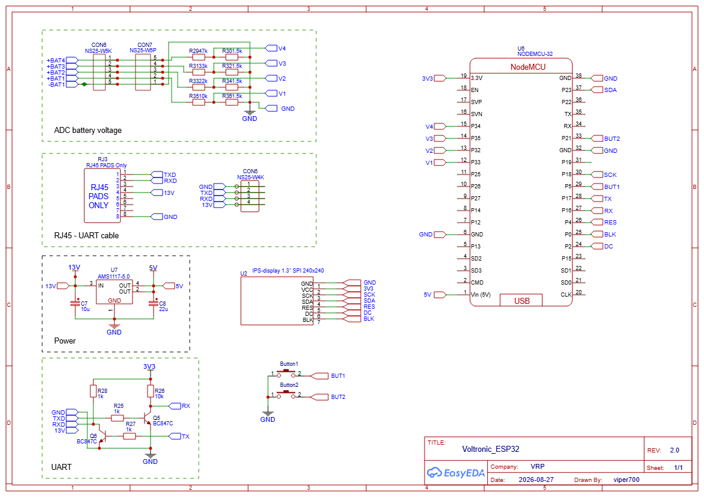

## Печатная плата и сборка устройства

В папке production есть [Gerber](production/Gerber_Voltronic_ESP32_v1.1.zip) для заказа печатной платы и [BOM](production/BOM_Board1_PCB1_2023-05-11.xlsx) файл компонентов.
Это для версии 1.1
Я заказывал платы на https://jlcpcb.com . Изготовляем плату и собираем. Внешний вид платы на картинке.
Для версии 2.0 небыло смысла заказывать плату, поэтому просто обрезал несколько дорожек на светодиоды и подпаял провода на прямую.

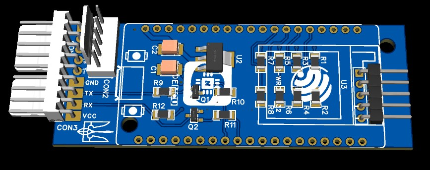
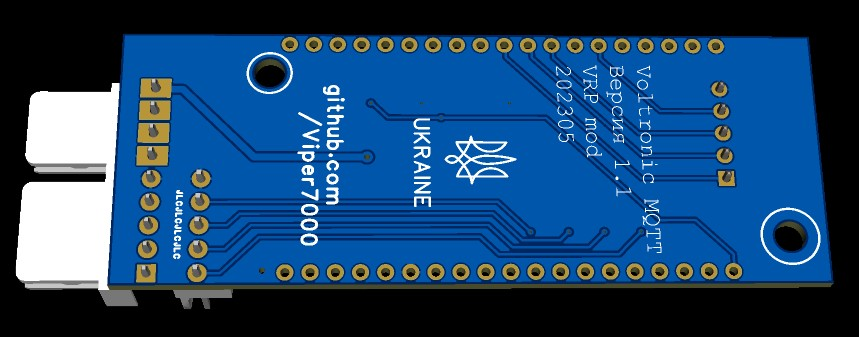

Для своего устройства я использовал корпус на DIN рейку шириной в 2 модуля. Спереди прозрачное стекло для установки вольтметров.

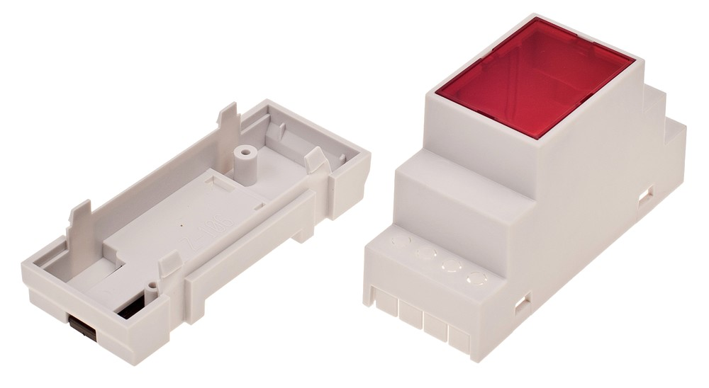

Дисплей заходит очень плотно. Красное стекло заменил на прозрачное. Вырезал из акрила 1мм. Дисплей можно закрепить каплями термоклея, чтобы не сместился. 
Также вынес наружу 2 кнопки - в прошивке пока не использовал. Плата в сборе закрепляется на корпусе винтами как и версия 1.1

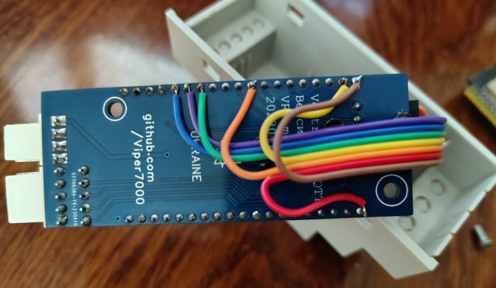 

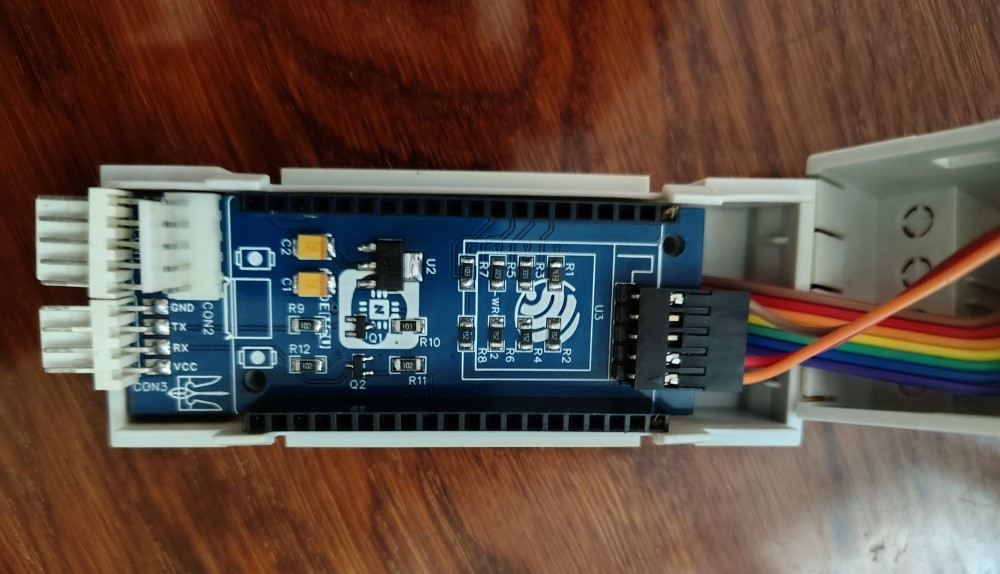

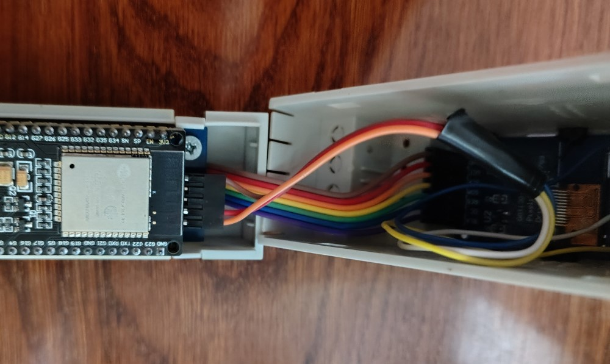

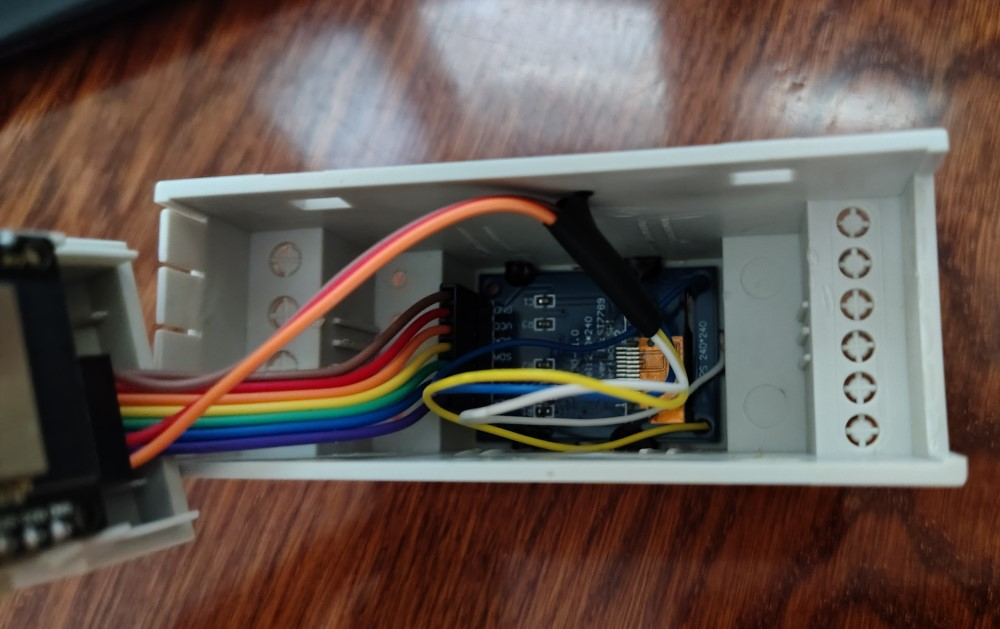

### Общий вид устройства (в центре). Справа, в аналогичном корпусе, передатчик BMS батареи для ESPHome

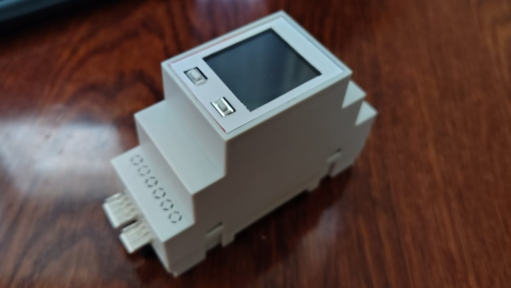

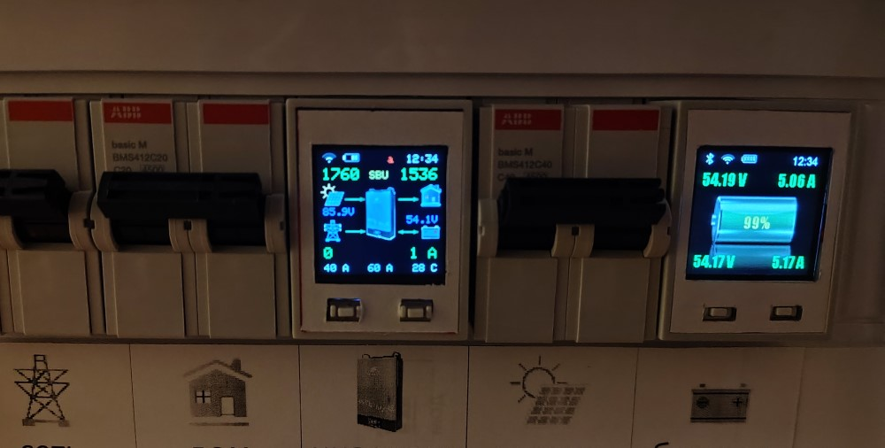

## Настройка и прошивка ESP, заливка файлов
Для начала открываем [скетч](firmware2.0/Voltronic_AJAX.ino) и прописываем свои данные. Обязательно не забудьте
* Название сети WiFi (WiFi SSID)
* пароль сети WiFi (WiFi Password)
* IP адрес MQTT сервера (MQTT Server IP)
* Название устройства MQTT, логин и пароль к вашему MQTT серверу (в строке client.connect("ESP_Voltronic", "mqtt", "mqtt"))
* Логин и пароль FTP (по умолчанию admin/1234)
* NTP сервер времени. У меня прописан локальный.
* Дополнительно я получаю время от HA. Там стоит автоматизация отправлять на MQTT время каждый 10 сек

<details>
<summary>Автоматизация времени в HA</summary>

```yaml
alias: Время MQTT
description: ""
triggers:
  - seconds: /10
    trigger: time_pattern
conditions: []
actions:
  - action: mqtt.publish
    metadata: {}
    data:
      evaluate_payload: false
      qos: 0
      retain: false
      payload: "{{states.sensor.time.state}}"
      topic: ha/time
mode: single
```

</details>

Далее компилирует скерч и заливаем в ESP. 
> :memo: **Настройки должны быть:** ESP32 Dev Module, Default 4Mb with spiffs (1.2Mb APP/1.5Mb SPIFFS), 240Mhz

Запускаем ESP. Когда на экране появятся все данные - ESP подключилось к сети. Смотрим на роутере какой IP у ESP и подключаемся по FTP (не забываем логин/пароль). Я использую Total Commander.
После подключения заливаем на FTP файлы, что в папке [firmware2.0/data](firmware2.0/data)

## WEB интерфейс
WEB доступен по IP адресу устройства. При наведении на клетку есть информация по значению. Все сделано просто и наглядно. WEB работает через AJAX. Каждую секунду отправляет запросы данных. На нижней кнопке время с секундами. Время меняется при получении ответа от устройства (посекундно). Если время идет скачками или зависает - устройство не отвечает или плохая связь. При нажатии на кнопку со временем - перегружается WEB страница (отправляется MQTT Discovery). Две иконки вверху: левая выводит информацию с устройства в формате json, правая переводит в настройки. В настройках переключаются режимы в блоке Voltronic Config. Там же есть апдейт прошивки. Для этого нужно скомпилировать скетч в bin формат: в Arduino Скетч/Экспорт бинарного файла.
Интерфейс расширен по сравнению с версией 1.1. Там же делал настройки сети, но так и не настроил. Все настройки прописаны в скетче
Внешний вид WEB. Это еще 1.1

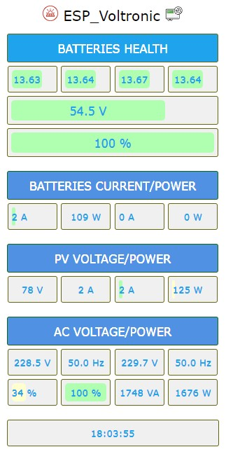 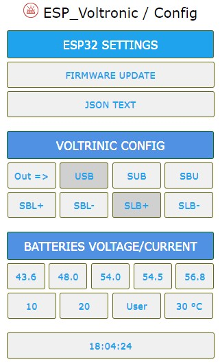

## MQTT в Home Assistant

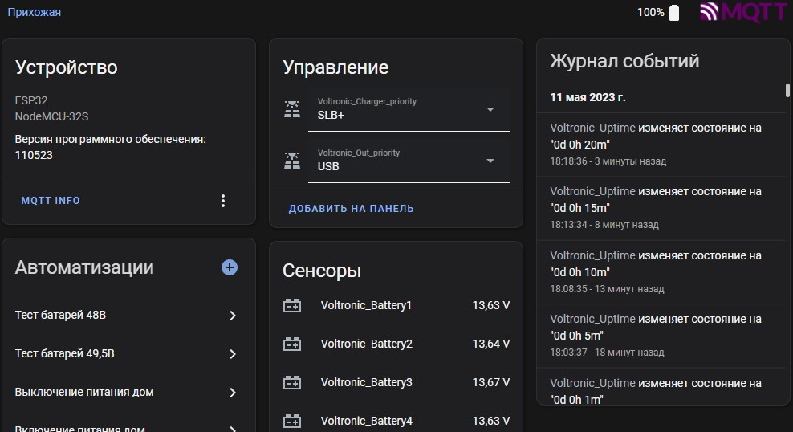

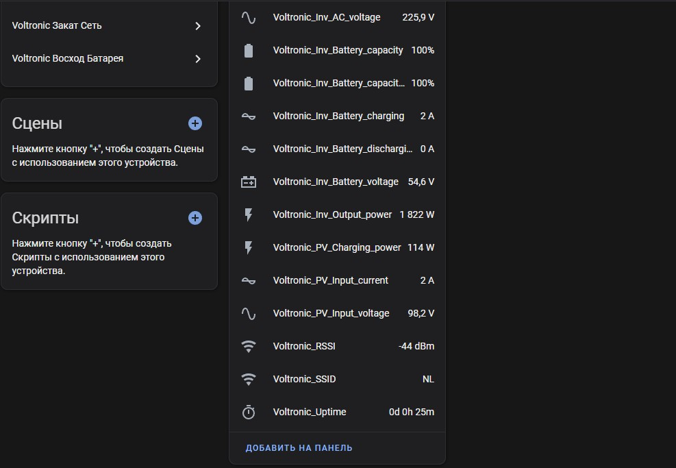

## В Home Assistant сделано так

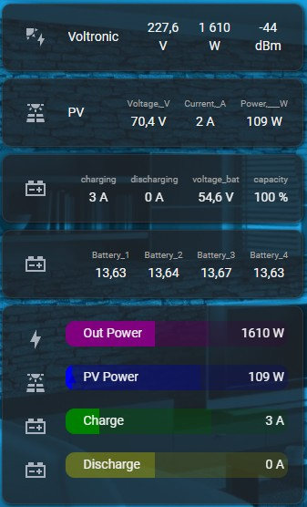

## Принцип работы и световая индикация
В строке статуса мощность сигнала WiFi и остаток батареи (расчетный для свинца). Справа - время, если все настроили правильно.
В середине появляются букоски
* a - читается заряд батарей
* S - читаются данные UART из инвертора
* W - подключается WiFi
* P - передаются данные на MQTT

### Порядок работы
Напряжение батарей читает 20 раз и вычисляет среднее. Наблюдал разброс при оцифровке напряжения и решил усреднить. На 20 раз уходит примерно 5 сек. Потом получает данные по UART и отправляет все по MQTT. Получается отправка примерно раз в 6 сек. В программе есть коэффициенты расчета напряжения батарей. Так как делитель напряжения собран из резисторов с допуском 5-10% - подгоняйте числа для более точного определения напряжения.

### Дополнительные материалы
В папке [manuals](manuals) есть дополнительные файлы:
* инструкция на солнечный инвертор на русском
* характеристики солнечного инвертора
* сервисная инструкция по ремонту на английском
* описания протокола UART для солнечного инвертора
