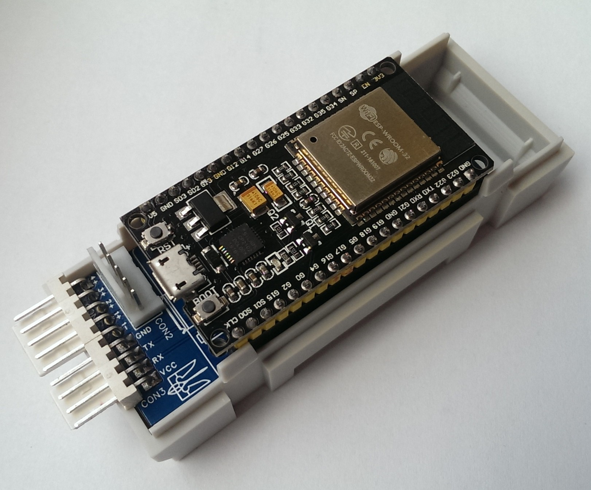

# Hardware development MQTT connection board for Solar inverter Voltronic (and clone of it) 
The board was developed for home use. The program EasyEDA was used. A full description will be after assembly and verification. All description will be in Russian. 

[Development and verification process here](development.md)

---

# Разработка платы под Солнечный инвертор Voltronic и его клонов для управления и мониторинга по средствам MQTT
Данное устройство разрабатывалось для себя. Для солнечной станции был выбран солнечный инвертор Voltronic AXPERT KING 5KW. У него есть UART порт для подключения компьютера, но нет ни каких беспроводных средств общения. Разработанная плата общается с инвертором через UART, мониторит параметры работы, задает режимы работы по солнцу и передает даные по MQTT. Дополнительно в моем устройстве установлены 4 вольтметра для мониторинга напряжения аккумуляторных батарей, а так же эти линии заведены через делитель напряжения на АЦП для оцифровки. Поднят WEB сервер для отображения параметров по веб и управления. Поднят FTP сервер для заливки файлов на WEB сервер. Для обновления данных по WEB используется AJAX. Питание платы идет от инвертора, поэтому ее в минимальном исполнении можно прицепить к инвертору для передачи параметров по MQTT без мониторинга батарей. Так же выведены 4 светодиода для отслеживания режимов работы устройства и мониторинга проблем. Далее про все по порядку будет ниже.

Плата разрабатывалась для дома. Использовалась программа EasyEDA. Полное описание будет после сборки и проверки в работе. Все описание будет на русском языке. Плата будет доступна к продаже в Украине для любителей самостоятельной сборки.

[Процесс разработки и проверки тут](development.md)

> :warning: **Предупреждение:** Там первоначальная схема устройства и она содержит ошибку! Рабочая схема версии 1.1 ниже.

## Принципиальная схема устройства версии 1.1 с исправленными ошибками

## Печатная плата и сборка устройства

В папке prodaction есть [Gerber](prodaction/Gerber_Voltronic_ESP32_v1.1.zip) для заказа печатной платы и [BOM](prodaction/BOM_Board1_PCB1_2023-05-11.xlsx) файл компонентов.
Я заказзывал платы на https://jlcpcb.com . Изготовляем плату и собираем. Внешний вид платы на картинке.

Для своего устройства я использовал корпус на DIN рейку шириной в 2 модуля. Спереди прозрачное стекло для установки вольтметров.

Внутрь на термоклей закрепил 4 вольтметра. Так же через отверстия вывел 4 диода. Закрепил тоже на термоклей.
Плата в сборе закрепляется на корпусе винтами.

 

 

  

## Настройка и пршивка ESP, заливка файлов
Для начала открываем [скетч](firmware/Voltronic_AJAX.ino) и прописываем свои данные. Обязательно не забудьте
* Название сети WiFi (WiFi SSID)
* пароль сети WiFi (WiFi Password)
* IP адрес MQTT сервера (MQTT Server IP)
* Название устройства MQTT, логин и пароль к вашему MQTT серверу (в строке client.connect("ESP_Voltronic", "mqtt", "mqtt"))
* Логин и пароль FTP (по умолчанию admin/1234)

Далее компилирует скерч и заливаем в ESP. 
> :memo: **Настройки должны быть:** ESP32 Dev Module, Default 4Mb with spiffs (1.2Mb APP/1.5Mb SPIFFS), 240Mhz

Запускаем ESP. Если диоды подключены и горит синий и зеленый диод - ESP подключилось к сети. Смотрим на роутере какой IP у ESP и подключаемся по FTP (не забываем логин/пароль). Я использую Total Commander
После подключения заливаем на FTP файлы, что в папке [firmware/data](firmware/data)

