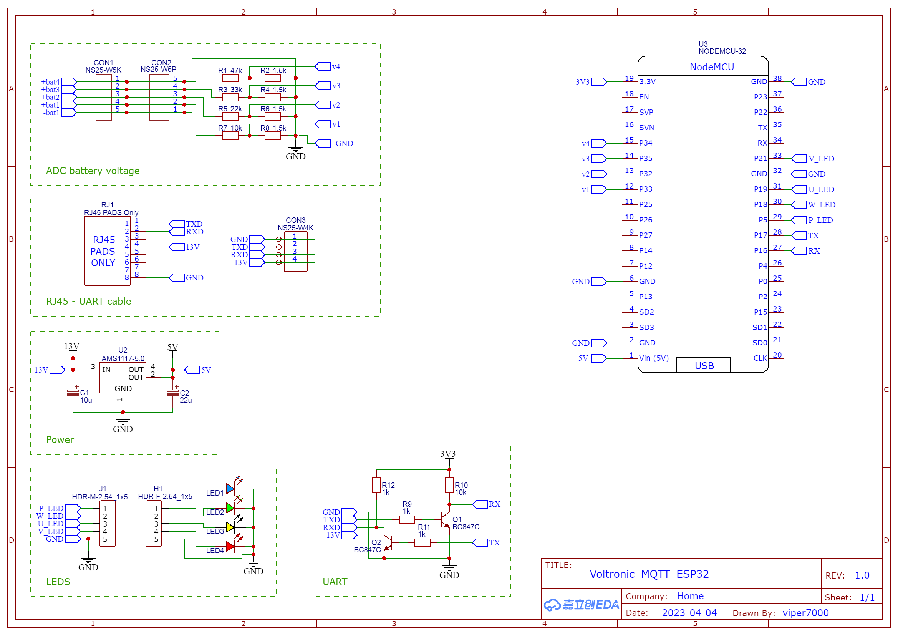
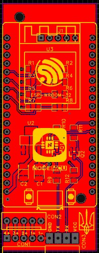
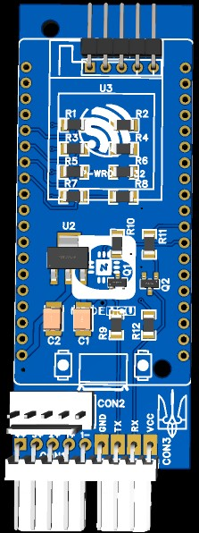

# Плата версии 1.0 в разработке

## Принципиальная схема платы

> :warning: **Предупреждение:** Это первоначальная схема устройства и она содержит ошибку! Рабочая схема версии 1.1 будет в описании проекта .
> 

## Разводка печатной платы
 

## Внешний вид платы
 

 

## Платы полученные с завода

## Сборка

## Тестирование и работа над ошибками
В собранном виде устройство не запустилось. Циклическая перезагрузка процессора. Ошибка: “flash read error”. Проверка показала, что один из выводов земли не подключен к земле. Тут и закралась ошибка. Вероятно в базе EasyEDA я взял пользовательский макет процессора ESP-32, в котором 2 вывод отмечен как GND. Проверил со своим процом - там тоже GND. А на самом деле там оказался вывод CMD.
Маркировка на самой плате процессора меня удивила. Может есть платы, где там и правда GND? :)

Можно просто вытянуть пин на межплатном переходе и он не будет соединен с платой. Для теста просто отогнул в сторону вывод CMD. 
Плата полностью рабочая.

> :memo: **Примечание:** Данная ошибка будет исправлена в версии 1.1 и здесь будут выложены исправленные Гербер файлы для заказа платы

